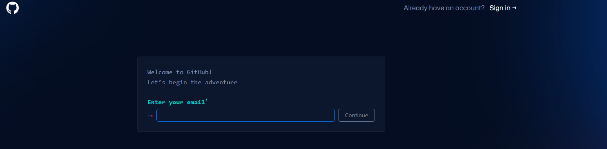
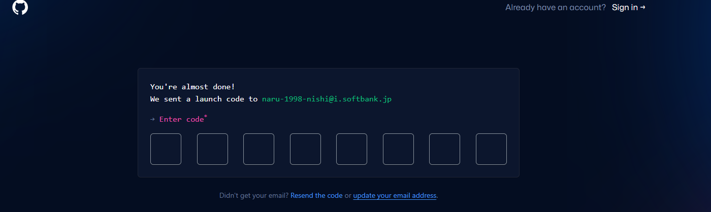
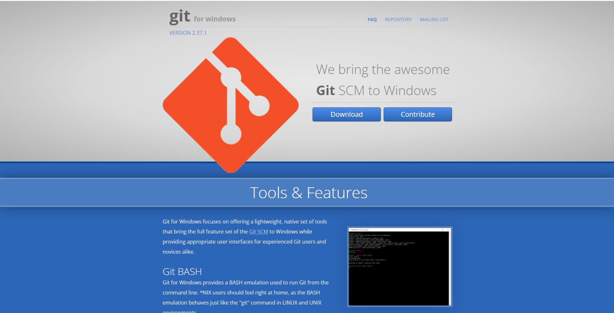
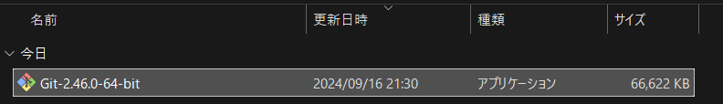
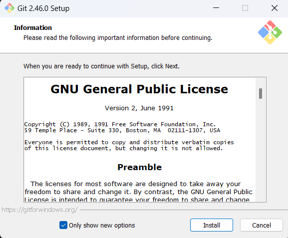
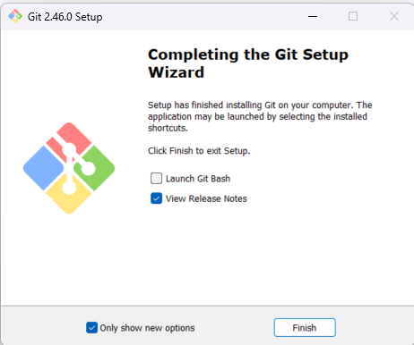

## 初めに
Git、VisualStudioCodeを使用してビルド、書き込みまで行うための環境構築方法を記載します。  
OSはWindowsです。  
※2024/9 時点のものを記載しておりますので現在とは異なるところはあるかもしれませんが、ご了承ください。  

## 1.Git環境の構築
### 1-1.GitHUbのアカウント作成
[GitHubサイト](https://github.com/)へアクセスして  ボックスに登録用のメールアドレスを入力し、[Sign up for GitHub] ボタンをクリックしてください。  
※フリーアドレスでも登録可能です。
  

以下のような画面が出たら出てくる内容に従って順番に入力してください。  
※「Enter your email」は自動入力されているはずです。

検証が完了したら登録したメールアドレスに対して認証コードが送られてきます。  
その際、画面が切り替わりますので送られてきたコードを入力してください。

以下のようにログイン画面が出てきます。  
登録したメールアドレスとパスワードを入力してログインしてください。  
ログイン出来たら、登録成功です。  
※初期設定画面に遷移しますので、こちらは自身に合わせて設定してください。  
  

### 1-2.Gitのインストーラをダウンロード
以下からGitのインストーラーをローカルにインストールしてください。  
[Gitfor Window](https://gitforwindows.org/)  

以下のような画面に遷移すると思います。 
 

「Download」をクリックしてください。  

### 1-3.Gitのインストール
ダウンロードしたインストーラーを実行してください。  
  

「install」を押してください。  
  

インストールが終了したら画面が切り替わるので「Finish」を押してください。  

### 1-4.Gitのセットアップ
ユーザー名とメールアドレスを設定します。  
Git Bashを実行して、以下のコマンドを実行してください。  
~~~
git config --global user.name "1-1で登録したユーザー名"
~~~
~~~
git config --global user.email "1-1で登録したメールアドレス"
~~~