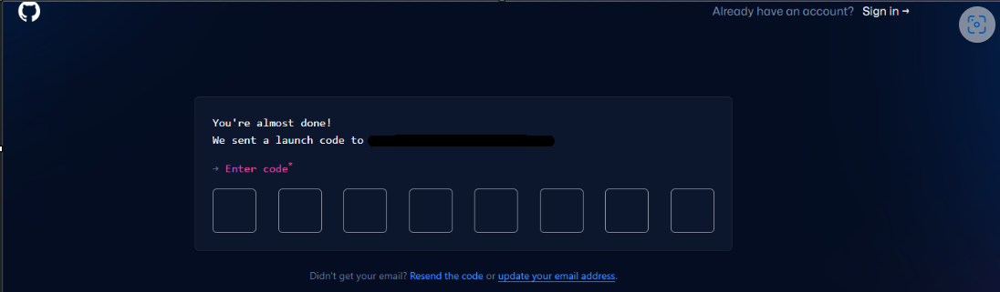
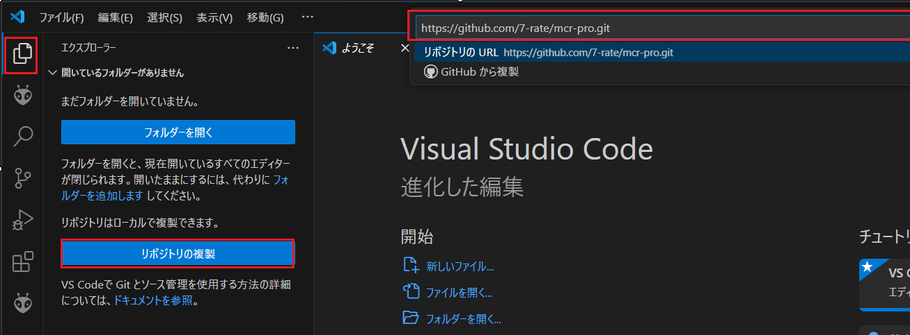
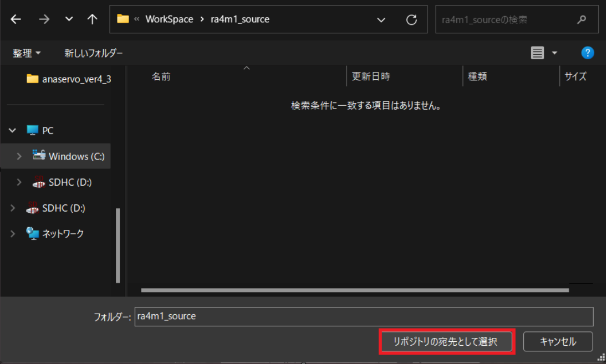
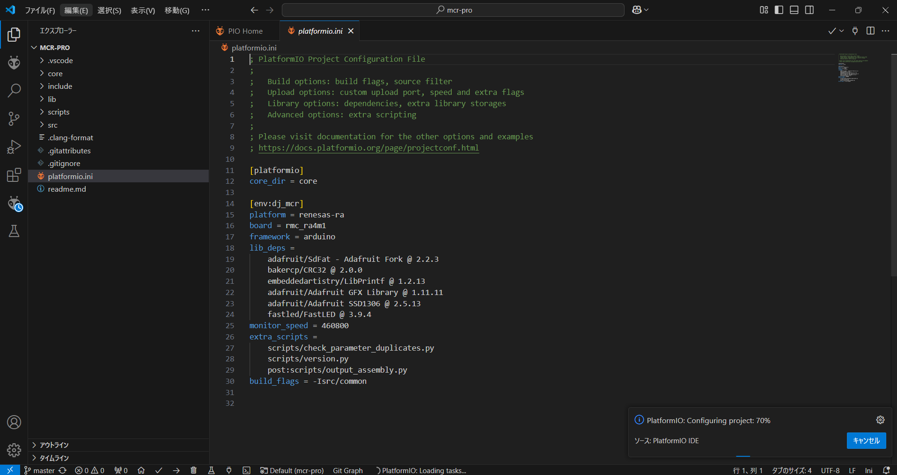

## 初めに
Git、VisualStudioCodeを使用してビルド、書き込みまで行うための環境構築方法を記載します。  
OSはWindowsです。 
※2024/9 時点のものを記載しておりますので現在とは異なるところがあるかもしれませんが、ご了承ください。  

## 事前準備
[RMC-RA4M1(rev2.0)基板 実習マニュアル](https://j-mcr.net/arduino_mcr/data/rmc_ra4m1_rev20_zisyu.pdf)の以下を実施してください。  
・3.2. 開発環境のダウンロード  
・3.3. Arduino IDE に「RMC-RA4M1(rev.2.0)」を追加する  
・3.5. ファームウェアを書き込む  

## 1.Git環境の構築
### 1-1.GitHUbのアカウント作成
[GitHubサイト](https://github.com/)へアクセスして  ボックスに登録用のメールアドレスを入力し、[Sign up for GitHub] ボタンをクリックしてください。  
※フリーアドレスでも登録可能です。
  

以下のような画面が出たら出てくる内容に従って順番に入力してください。  
※「Enter your email」は自動入力されているはずです。

検証が完了したら登録したメールアドレスに対して認証コードが送られてきます。  
その際、画面が切り替わりますので送られてきたコードを入力してください。

以下のようにログイン画面が出てきます。  
登録したメールアドレスとパスワードを入力してログインしてください。  
ログイン出来たら、登録成功です。  
※初期設定画面に遷移しますので、こちらは自身に合わせて設定してください。  
  

### 1-2.Gitのインストーラをダウンロード
以下からGitのインストーラーをローカルにインストールしてください。  
[Gitfor Window](https://gitforwindows.org/)  

以下のような画面に遷移すると思います。 
 

「Download」をクリックしてください。  

### 1-3.Gitのインストール
ダウンロードしたインストーラーを実行してください。  
  

「install」を押してください。  
  

インストールが終了したら画面が切り替わるので「Finish」を押してください。  

### 1-4.Gitのセットアップ
ユーザー名とメールアドレスを設定します。  
Git Bashを実行して、以下のコマンドを実行してください。  
~~~
git config --global user.name "1-1で登録したユーザー名"
~~~
~~~
git config --global user.email "1-1で登録したメールアドレス"
~~~

## 2.VisualStudioCode環境の構築
### 2-1.VisualStudioCodeのインストール
以下のダウンロードページにジャンプします。  
https://code.visualstudio.com/download

ダウンロードページでWindows用のインストーラーをダウンロードします。  

ダウンロードしたインストーラーを実行してください。  
  

「同意する」を選択して「次へ」を教えてください。  
   

追加タスクの選択画面で必要に応じて追加タスクにチェックを入れて「次へ」を押してください。  
  

「インストール」を押してください。  
  

インストールが終了したら画面が切り替わるので「完了」を押してください。  
　　

### 2-2.VisualStudioCodeの拡張機能追加
#### 日本語化
VisualStudioCodeを開いて画面の左のタブから一番下のExtensionsを（または「Ctrl＋Shift＋x」を入力）押します。    

画面左上の検索窓（Search Extensions in Marketplace）に「Japanese」と入力し検索結果に表示される「Japanese Language Pack for Visiual Studio Code」をインストールします。  
  

インストール完了後、画面右下にWould you like to...というメッセージがポップアップするので「Change Language and Restart」をクリックします。    
  

アプリが再起動し日本語化されたVisualStudioCodが開きます。  
  

#### PlatformIOのインストール
VisualStudioCodeを開いて画面の左のタブから一番下のExtensionsを（または「Ctrl＋Shift＋x」を入力）押します。    
  

画面左上の検索窓（Search Extensions in Marketplace）に「plat」と入力し検索結果に表示される「PlatformIO IDE」をインストールします。 

拡張機能がインストールされると、左側の欄にアリさんマークが追加されます。

すると一番上にアリさんのマークの拡張機能がでてくるので押してください。  
画面右下にポップアップが出現します。
これはplatformIO IDEをインストールしていることを表しています。しばらく待ちましょう。

Platform IOのインストールに成功したら、ポップアップが出現するので、Reload Nowを押して再起動します。  

#### Git Graphのインストール
VisualStudioCodeを開いて画面の左のタブから一番下のExtensionsを（または「Ctrl＋Shift＋x」を入力）押します。  
  

画面左上の検索窓（Search Extensions in Marketplace）に「Git Graph」と入力し検索結果に表示される「Git Graph」をインストールします。

## 3.ソースコードのクローン、ビルド、書き込みの方法
### 3-1.ソースコードのクローン
Cドライブに「WorkSpace」というフォルダを作成し、その中に更にフォルダを作成してください。  
  

左のタブの「エクスプローラー」を開いて「リポジトリの複製」を押してください。  
上部のリポジトリのURLに以下を入力してください。  
https://github.com/7-rate/dj-mcr-ra4m1.git

フォルダ選択画面が開くため作成したフォルダを選択して「リポジトリの宛先として選択」を押してください。  
  

クローンが終了すると以下の画面が表示されるため「開く」を押してください。  
クローンされたソースコードのフォルダが開きます。    

PlatformIOの初期化を行っているため終了するまで待ちます。

終了した以下が表示されます。  

### 3-2.ビルド、書き込み
下部の「PlatformIO:Bulid」を押してください。  
ビルドが実行されます。

ビルドが成功すると以下が表示されます。  

マイコンボードに接続し下部の「PlatformIO:Upload」を押してください。  
書き込みが実行されます。  

「success」が表示されたら成功です。  
